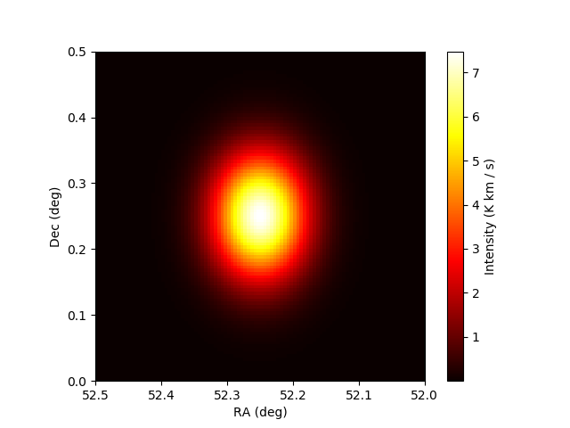

# Innovation sprint: Learning `astropy` package

Innovation sprint where I did as many `astropy` tutorials as I can.

The [Examples](https://docs.astropy.org/en/stable/generated/examples/index.html) are found here linked

## Example1 - [Convert RGB JPEG image into FITS using](https://docs.astropy.org/en/stable/generated/examples/io/split-jpeg-to-fits.html#sphx-glr-generated-examples-io-split-jpeg-to-fits-py)
  - [pillow](https://python-pillow.org)  for reading the image
  - `matplotlib.pyplot` to display
  - `astropy.io.fits` to save FITS files

## Example1 - [Determining and plotting atlaz coordinates of a celestial object](https://docs.astropy.org/en/stable/generated/examples/coordinates/plot_obs-planning.html#sphx-glr-generated-examples-coordinates-plot-obs-planning-py)
  - Use [SkyCoord](https://docs.astropy.org/en/stable/api/astropy.coordinates.SkyCoord.html#astropy.coordinates.SkyCoord) instance of an object to determine alt-az coordinates using `astropy.coordinates.EarthLocation` and `astropy.time.Time` objects.
  - For more convenient observation planning, see [astroplan](https://astroplan.readthedocs.io/en/latest/)
  
  ## Next I learned about convolution
  - Did an exercise on how to convolve a 1-D `sinc` function with 1) a 1-D `delta` function and with 2) a 1-D`gaussian` function.
  - Went to a 2-D case where I convolved 2-D `numpy arrays` to practice and better understand the concept.
  - An application of the above is on imaged data of two different surveys done with the VLA telescope
    - FIRST (high resolution)
    - NVSS (lower resolution)

An image of the same object in the two surveys looks very different, one would swear they are different objects. Even the flux density measurements of the two look look different. To correct for this, we use convolution. The differences are caused mainly by the difference in the resolution. If we make the resolutions the same, we could potentially make the two images close to being the same.

## [Astropy Quantities & Units for astrophysical calculations](http://learn.astropy.org/rst-tutorials/quantities.html?highlight=filtertutorials%20filterradioastronomy)
  - Here I use another useful package in `astropy` used to do calculations of physical quantities and interprete their physical meaning.
  - We can do arithmetic and plot Quantities, do unit conversions and manipulation
  - Can import physical constants such as: `h`, `k_b` etc. Using `from astropy.constants import *`
  - `Quantity` objects inherit and extend `numpy.ndarrays`, we can perform numpy functions on them.
  - We can convert e.g `parsec` to `km` using the `.to()` attribute
  - Always treat `Quantity` objects as `numpy` arrays as opposed to `math.` objects.
  - Did a tutorial where I calculate the velocity of the earth around the sun given its distance from the sun, using Kepler's law.
  - Another exercise was to calculate the mass of a molecular cloud of cold H2 gas(the gas that collapses to become stars). This is not detectable with telescopes but we can infer it by oberving CO(populary known as a tracer for H2). We calculate the column density as a way to estimate the mass of the cloud using physics. The image below is synthetic data of the cloud plotted in spacial coordinates and the third axis is the intensity distribution/brightness temperature(what the telescope measures).
  
  
  
  - See [Exercises](http://learn.astropy.org/rst-tutorials/quantities.html?highlight=filtertutorials%20filterradioastronomy)
  
  - @mmphego shared: [astronomy software](https://github.com/orbitalindex/awesome-space)
    - `astropy` is one among many

## [Part 2 of innovation](https://docs.astropy.org/en/stable/)
  - I am reading the documentation with the aim to find how a developer can make contributions. I have found the procedure [here](https://docs.astropy.org/en/stable/development/vision.html) and [code](https://www.astropy.org/contribute.html#code)
    - [Join dev email-list](https://groups.google.com/forum/#!forum/astropy-dev)
    - The [project](https://github.com/astropy?type=source) which contains the repos to `astropy package` and the `affiliated packages`, which are mainly intended for future integration in the core package
    - CI done with [Travis](https://travis-ci.org/)
    - Documentation made easy with [Sphinx](https://www.sphinx-doc.org/en/master/)
    - There is a new labeling system where issues are classified according to `Effort`. This helps contributors find suitable starting points.
               - [Novice](https://github.com/search?p=2&q=label%3Apackage-novice&ref=searchresults&state=open&type=Issues&utf8=%E2%9C%93), see [more](https://www.astropy.org/contribute.html#code)
               - [Effort-low](https://github.com/search?p=2&q=label%3Apackage-novice+label%3Aeffort-low&ref=searchresults&state=open&type=Issues&utf8=%E2%9C%93)
